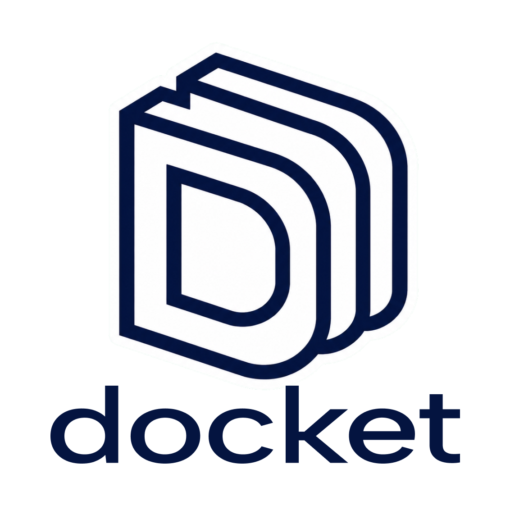

<h1 align="center">
  
</h1>

<p align="center"><strong>The durable control plane for personal operations.</strong></p>

<p align="center">Single operator · self-hosted · provenance-first · Discord-native</p>

Docket turns everyday instructions and incoming evidence into durable,
traceable operations. It remembers the people, organizations, preferences, and
commitments that shape an operator's life; surfaces what deserves attention;
and carries authorized intent into Google Calendar.

It is deliberately not a chatbot memory layer. Conversations are an interface,
providers are projections, and model output is interpretation. Docket owns the
record in between.

> **The operator is the authority. PostgreSQL is the record. Everything else is
> evidence or projection.**

## The product model

Personal assistants often collapse understanding, memory, authority, and action
into one model turn. Docket separates them so each can fail without corrupting
the others.

| Layer | Docket's responsibility |
| --- | --- |
| **Evidence** | Preserve exactly what the operator said and what providers exposed. Later information never erases earlier evidence. |
| **Meaning** | Resolve people, organizations, dates, preferences, and affected objects; ask one focused question when meaning is incomplete. |
| **Authority** | Accept canonical change only from an authenticated operator utterance. Email, web content, model inference, and cron work cannot authorize it. |
| **Canonical state** | Maintain the current registry, policy, calendar model, decisions, and triage state in PostgreSQL with public provenance references. |
| **Action** | Derive provider operations from committed intent, execute them asynchronously, and reconcile outcomes that are uncertain after transmission. |
| **Projection** | Render current state into Discord and Google without treating either surface as canonical. |

### One place for operational context

Docket maintains a typed network of people, organizations, institutions,
courses, places, projects, services, identities, relationships, and facts. It
also stores explicit preferences: the durable rules that decide what matters,
where an event belongs, and what should be suppressed.

That context is not reconstructed from chat history. It is versioned, bounded,
and addressable through stable public references.

### Intent that survives the conversation

An explicit, complete instruction can commit as soon as Docket resolves its
objects and scope—there is no redundant approval ritual. Related effects become
one immutable ChangeSet, so canonical state and the provider operations it
requires are recorded together or not at all.

When a request is ambiguous, Docket preserves the in-progress intent and asks
for the smallest useful clarification. An explicit correction can supersede
old state while retaining its history; an unresolved incompatibility becomes a
conflict instead of a silent overwrite.

### Attention without autonomous authority

Docket ingests bounded Gmail and Calendar evidence through an isolated triage
path. It can correlate observations, apply existing preferences, suppress known
noise, open an AttentionCase, and assemble morning or night briefs.

Triage cannot change operator-owned context or call providers. A reply to a case
returns through the authenticated interactive path, where it can become real
intent.

### Calendar control as a projection of intent

Canonical events live in Docket and route through operator-defined Calendar
lanes. Explicit creates, updates, reminder changes, and cancellations compile
into the required Google operations after the canonical commit. Calendar reads
come from a bounded, freshness-aware cache; reminders can project to Google and
the configured Docket queue.

Provider success is a separate fact from canonical commitment. A timeout after
transmission becomes reconciliation work—not a blind retry and never a false
success message.

### A complete answer to “what happened?”

Every operator turn, interpreted statement, decision, tool call, ChangeSet,
provider operation, and response carries a typed public reference. Docket can
trace a visible outcome back to its basis without exposing internal database
identifiers or turning raw provider payloads into authority.

## How Docket behaves

| Moment | Product behavior |
| --- | --- |
| “Put lunch with Maya on my personal calendar tomorrow.” | Resolve Maya, the local date, and the lane; commit the event and queue its Google projection in one transaction. |
| “Actually, make it 1:30.” | Preserve the original evidence, record the correction, and project the new canonical version. |
| An email looks actionable. | Triage it as untrusted evidence, correlate it with known context, and surface a case or brief when operator input is needed. |
| Two claims disagree without a clear correction. | Open a conflict and block only the affected change until the operator resolves it. |
| Discord delivery fails. | Keep the canonical result and retry the projection through the outbox. |
| Google receives a request but the response is lost. | Mark the outcome uncertain and reconcile before retrying or reporting success. |

## Technical model

The experience is conversational; the implementation is deliberately not. The
interactive and triage paths have different capabilities, and all durable truth
converges on PostgreSQL.

```text
Authenticated operator message
        │
        ▼
Discord ingress + Hermes
  authenticate source · persist immutable utt_ · load bounded contract
        │
        ▼
Interactive MCP (22 tools; only 2 mutate canonical state)
        │
        ▼
IntentSession → statements → clarification/conflict → ChangeSet
        │
        ▼
PostgreSQL canonical transaction
        ├── registry · preferences · lanes · events · decisions · audit
        ├── provider Operation intents ──► worker ──► Google
        └── outbox events ───────────────► worker ──► Hermes / Discord

Gmail + Calendar evidence
        │
        ▼
bounded ingestion → isolated triage MCP (4 non-authoritative tools)
        │
        ▼
ContextPacket → AttentionCase / DailyBrief
        │
        └── operator reply returns to the authenticated interactive path
```

### Trust boundaries

- Every authenticated operator message is stored verbatim as `utt_` before
  interpretation or mutation. Persistence failure is fail-closed.
- Evidence and canonical truth are separate. Canonical changes retain
  `basis_refs` back to their authority.
- Only `docket_commit_changeset` and `docket_resolve_conflict` mutate canonical
  state on the 22-tool interactive surface.
- The four-tool triage surface can observe and classify; it cannot mutate
  canonical state or providers.
- Canonical changes and their required provider intents commit atomically.
  Provider calls happen afterward.
- Discord messages, Hermes responses, provider data, logs, and in-memory state
  are never canonical.
- Default tool output is bounded to 16 KiB; explicit audit output is bounded to
  64 KiB and paginates beyond that.

The signed ontology is `ONT-DELTA-2026-08-27`, frozen at SHA-256
`3d744f4d021f8a605086152eb76743a7ec5a7ed2c8754694e38c1a891a14b5e1`.
Tracked readiness and traceability evidence lives in
[`deltas/`](deltas/) and the
[ontology rollout verification](docs/ontology-rollout-verification.md).
Private source specifications and handoffs remain in ignored `specs/` and
`deltas/` files; ordinary documentation does not amend signed architecture.

### Stack

| Concern | Implementation |
| --- | --- |
| Service boundary | Python 3.12–3.14, FastAPI, Pydantic, FastMCP |
| Durable state | PostgreSQL 16, SQLAlchemy, Alembic |
| Conversation | Pinned Hermes Agent, Discord gateway and Docket plugin |
| Providers | Google Calendar and bounded Gmail ingestion |
| Background work | Operation, reconciliation, outbox, projection, ingestion, triage, reminder, retention, and backup workers |
| Deployment | Docker Compose with health, migration, drain, backup, and rollback gates |
| Verification | pytest, Ruff, strict mypy, isolated PostgreSQL Compose smoke |

### Repository map

| Path | Purpose |
| --- | --- |
| [`src/docket/`](src/docket/) | API composition, schemas, services, persistence, MCP surfaces, providers, and workers |
| [`hermes/`](hermes/) | Pinned plugin, generated tool contracts, prompts, skills, and preference templates |
| [`migrations/`](migrations/) | Ordered Alembic history and append-only persistence protections |
| [`tests/`](tests/) | Unit, integration, adversarial, migration, and contract evidence |
| [`scripts/docket`](scripts/docket) | Supported validation, smoke, status, backup, and deployment lifecycle |
| [`docs/`](docs/) | Operations, recovery, integration contracts, and rollout verification |

## Verify a checkout safely

Docket targets a credential-bearing, single-operator deployment rather than a
hosted multi-tenant installation. Local verification requires
[uv](https://docs.astral.sh/uv/) and Docker with Compose v2.

```bash
git clone https://github.com/nkuhanas/Docket.git
cd Docket
scripts/docket check
scripts/docket compose-smoke
```

`check` runs the full test suite, Ruff, and strict mypy in a test environment.
`compose-smoke` builds an isolated `docket-smoke-*` PostgreSQL + Docket project
on port `18080`, forces [`.env.example`](.env.example), and uses only the dummy
credentials in [`secrets/smoke/`](secrets/smoke/). It does not load the live
`.env`, start Hermes, or contact Discord or Google.

If Docker reports permission denied for `/var/run/docker.sock`, run `sudo -v`
once before the lifecycle command. Do not recreate the smoke sequence manually
against a production environment.

### Safe defaults

The checked-in configuration keeps every external capability closed:

```dotenv
DOCKET_CALENDAR_READS_ENABLED=false
DOCKET_EXTERNAL_WRITES_ENABLED=false
DOCKET_GMAIL_INGESTION_ENABLED=false
DOCKET_GMAIL_WRITES_ENABLED=false
```

Smoke, development, and test environments select stateful fake adapters. In
production, a disabled write gate pauses or rejects provider work; Docket never
records fake provider success. The Hermes Compose profile is opt-in.

## Configure and operate a real instance

Production setup is intentionally operator-present. Start with
[`secrets/README.md`](secrets/README.md) and the
[operations runbook](docs/operations-runbook.md), then use the repository
commands rather than ad hoc Compose sequences.

The main bootstrap commands are:

```bash
# Create or reuse database and SearXNG secrets; atomically update .env.
uv run docket-production-config

# Authorize Docket's Google Desktop-app OAuth client.
uv run docket-google-auth status --credentials-dir secrets/local
scripts/setup-google-oauth.sh

# Render the ignored Hermes runtime from configured Discord IDs.
scripts/prepare-hermes-home.sh
sudo docker compose --profile hermes run --rm hermes setup
```

These commands do not silently enable Calendar reads, Gmail ingestion, or
provider writes. Turn on each gate only after the deterministic suite passes and
an operator is present for the corresponding live-account verification.

### Supported lifecycle

| Command | Purpose |
| --- | --- |
| `scripts/docket status` | Show source revision, service health, and bounded in-flight work. |
| `scripts/docket backup` | Create or confirm the daily age-encrypted PostgreSQL backup. |
| `scripts/docket verify-restore` | Restore into disposable PostgreSQL and verify the recovery point. |
| `scripts/docket predeploy` | Check clean synchronized `main`, green CI, production configuration, and durable-state gates. |
| `scripts/docket deploy` | Drain work, back up PostgreSQL, migrate, replace Docket and Hermes, and verify the live stack. |
| `scripts/docket deploy-ingress` | Replace stable Discord ingress through its quiesced handoff path. |

An image rollback does not reverse a database migration. Follow the
migration-specific recovery procedure and verified backup instead of retagging
an old image.

### Encrypted recovery points

Initialize the restore-only age identity before enabling scheduled backups:

```bash
scripts/setup-backup-age.sh
scripts/docket backup
DOCKET_BACKUP_AGE_IDENTITY_FILE=secrets/restore/backup_age_identity \
  scripts/docket verify-restore
```

Only the public recipient belongs in `.env`. The private identity stays in the
ignored `secrets/restore/` directory and is mounted only into the disposable
restore-verification container. Keep an offline copy; without it, encrypted
backups cannot be read.

## Documentation

- [Documentation index](docs/README.md) — the route into all current operating
  and verification notes.
- [Operations runbook](docs/operations-runbook.md) — symptom-first diagnosis,
  safe recovery, credential bootstrap, and live verification.
- [Ontology rollout verification](docs/ontology-rollout-verification.md) —
  signed authority, traceability, migration, acceptance, and rollout evidence.
- [Pinned integration contracts](docs/pinned-integration-contracts.md) — Hermes,
  MCP, container, and Compose seams to revalidate during upgrades.
- [Semantic operations verification](docs/semantic-operations-verification.md)
  — direct intent, triage, entity, Calendar, and brief behavior.
- [Contributing](CONTRIBUTING.md) — change workflow, commit format, CI, and the
  deployment boundary.

## Pinned Hermes integration

- Release: `v2026.7.20`
- Source revision: `3ef6bbd201263d354fd83ec55b3c306ded2eb72a`
- Image: `nousresearch/hermes-agent:v2026.7.20@sha256:f7b35053268f532f98955195c909f15a230470fbcbdacaa9fdecb95707dad04a`

The tag, image identity, MCP support, plugin discovery, and gateway seams are
treated as a single integration contract. Revalidate all of them together when
upgrading Hermes.
